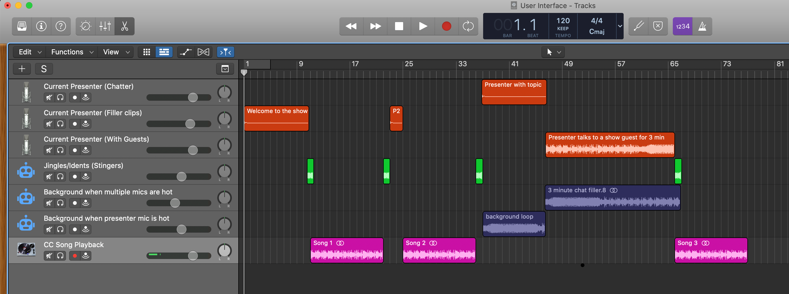

# 🎙🎶🤖 Everybody-can-DJ Automated Cloud Radio Station 🤖🎶🎙
A solution that creates a continuous stream of copyright-free music that most would not know about - but the DJ only needs a laptop, a decent microphone and any DAW (Reaper/Logic Pro X/Audacity/Garageband) to record the clips.

**n.b. it is understood that this is available as software already! This is more of a _programming challenge_. This was possible with software for Windows XP like SAM Broadcaster decades ago. Commercial broadcast studios will have a solution that already allows playout with automatic bumpers/jingles/stingers, play a sample of pre-recorded clips e.g. "The Best of XXX" show would play to fill out the station at 4AM local time when there is obviously no need for a presenter at this time.**

**Project Aims**:
  - To allow anybody to create a radio show as a drag and drop experience. The entire show is not pre-recorded, it is almost turning JSON into a show that the "broadcasting agent" will listen to changes - the show can be switched up whilst it is streaming!
  - To allow anybody to create an automated radio channel of their own with free/open source software.
  - To allow multiple stream locations, e.g. Discord and any other "audio only" solutions.
  - To provide a solution for "background" music for streamers.
    - This would need probably a second stream option which was just music too.
  - To integrate a very simple UI to find music by genre, similar to how DJs do now with Beatport and similar, but this would be for CC music.
    
### Who would use this?

**This is clearly a point to research - is this useful to communities, Discord servers, streamers, community groups, local towns, the inevitable/possible post-2020 tribalism?**

### What's the first radio station?

As there is some fantastic CC music knocking about, the "first instance" of this radio stream would be curated by the DJs that volunteer their time to create the vocal fillers like radio, interview guests and pick their favourite CC music, by genre, whatever - the show would be up to them if it was a specific genre!

The UI would be similar to any sort of digital DAW and would allow the DJ to create their playlist for a show that is scheduled for even another day. You would be able to build the show at 11pm on a Thursday evening for broadcast at 6am.

The best way I can share what the "automated stream" would compromise of, as an overview, this would be what `version-1.0` would be capable of is in a Logic Pro session which is only here for a "reference", anybody familiar with a DAW will be screaming "that the session makes no sense in time" - but it's just a visual device.

### But this seems a bit backwards being pre-recorded?

Pre-recorded webinars are to blame ;-). . But it doesn't actually matter that they are pre-recorded, for the proof of concept, we won't need to patch in guests (they'd be clips already made) - which would definitely blow the scope of the project wide open.

**This project would become "joining" a realtime audio session EVENTUALLY** - however this a barrier to entry because 5G/Fibre links are not "generally available" - it would therefore prevent somebody with a 10mbps capped/terrible connection from making content/DJing. This project ties in with another project which will be linked soon, which would allow *realtime* presenting (mobile networks improving to ≤1ms latency).

### Allowing being completely wrong about this project ;)
There is a high probability, like all assumptions when creating a software product, that because I actually have no commercial radio experience, I don't correctly understand how it's put together, but even if this project goes nowhere, at least I can fill out this README with basically a "thought experiment". The public are welcome to have a laugh at how wrong the assumptions here are.

### Allowing to be completely wrong to use commercial radio as a loose starting point:
This provides a good formula for what is essentially the real reason for this e.g. we have jingles, ad slots, whatever like a real station and it's just really for a fun proof of concept.

The user interface is the most challenging part of this, as you'd need to be able to in upload and replace clips in realtime, and provide a web interface which would be just "tracks".

### Idea/Stream of consciousness:
I have (as of 26 July 2020) a "huge guess" on how a modern day radio station functions. I have never ever sat in a professional radio station, probably as I am a programmer not a recording artist 😅.

I plan to bring in contributors to this project to bring insight into how everything works in a "typical broadcast-grade radio station".

This YouTube video of [Chris Moyles pranking Vernon Kay](https://youtu.be/qVphKh7vP28) inspired this idea to see how possible it would be to replicate this "room of equipment" into a **broadcast-grade radio station in the cloud**. The idea is to compress the entire rack into a solution in the cloud.

**The huge guess is that this is:**

As this is "broadcast radio" they will need to be able to patch in microphones live, so a lot of this kit won't need to be "emulated" until the project would be "realtime", however as a guess:

  - Racks contain:
    - A digital snake (over ethernet/fibre) to all the "broadcast" rooms so you can patch inputs such as the microphones into great pre-amps for that sweet radio voice.
    - Redundant servers of the software that runs the digital desk in the studio e.g. one can crash and they can switch between A/B automatically for broadcast.
    - Existing software or even creating "custom screens" for the presenter, newsreader, weather and something for the producer so they can "control the program", inserting things like text messages that have come in to the program.
    - Clearly has a vocal DSP unit that may have been put in for this prank/gag.
      - It seems far-fetched that the presenter would need to key their voice up or down? Unless this unit provides FX (reverb etc) for the mics.
  - There is clearly a huge patch panel for shows that need to patch in funky things like iPads for Facetime guests? Sound FX boards? Outboard effects? Who knows!
    
**There's quite a few things an automated radio station would still need:**
  - Jingles/Stingers/Idents would need to be created for the station
    - They would need to be:
      - In a number of major keys/octaves (unless we can change key with clips!?)
      - Be of different lengths (e.g. transitions between segments, transitions into songs, 16 bars @ 120bpm etc.)
  - Automation: Can the solution build up a playlist (like a broadcast radio station) for the day/week/month based upon some form of Top 40 of its own?
  - A presenter/host still 🙃🙃🙃🙃🙃🙃🙃🙃🙃 - until there is a really amazing text-to-voice AI-trained radio voice!!!!!!

There is also probably a sampler somewhere that is full of whatever silly clips are needed for a segment e.g. a quiz would need a sound effect 

## tl;dr (ish)

- Create a automated radio station by taking hints from commercial radio stations and their configuration.
- Make it easy to deploy anywhere with not much effort.
- Provide a UI where you can create a "schedule" and also continue streaming previous sessions at different timezones or simply just playing CC music from "the Top 100"?
- Provide a realtime DAW-like Drag and Drop UI for presenters to change their show, know how long is allowed in the "spaces" between songs/segments.
- Allow the volunteer "DJs" to add personality to a stream and interview guests.
- It is not intended to be just a "cloud radio stream" of music **as this was possible using Shoutcast/REALPlayer 20 years ago**.
- DJs would be very welcome to add whatever personality to their show - whilst building the show - it would prompt to create audio tracks even with suggestion of what to say: "That was Mr Brightside - The Killers, <insert comment here>".
  - It would calculate how long that clip needs to be in seconds.
  - DJs would be given the speed of the current song, maybe even download it to the client automatically - and the amount of "bars" until the vocal of song and the BPM of the song. This would allow to create a take with the "music" in the background.

### initial stupidity with the idea:
  - The functionality that suggests what the DJ records (for a show to be complete) would be the typical "Relative time" you would dub over a vocal bumper e.g. "My name is Stephen Mc DJFace, you're listening to the Y show on Radio Z, it's just gone quarter past 3."
    - This would obviously be whatever the local time is and simply not work :-D
    
### things that are definitely not using the correct terms:

  - stingers/jingles/bumpers/whatever are definitely not correct everywhere :-P